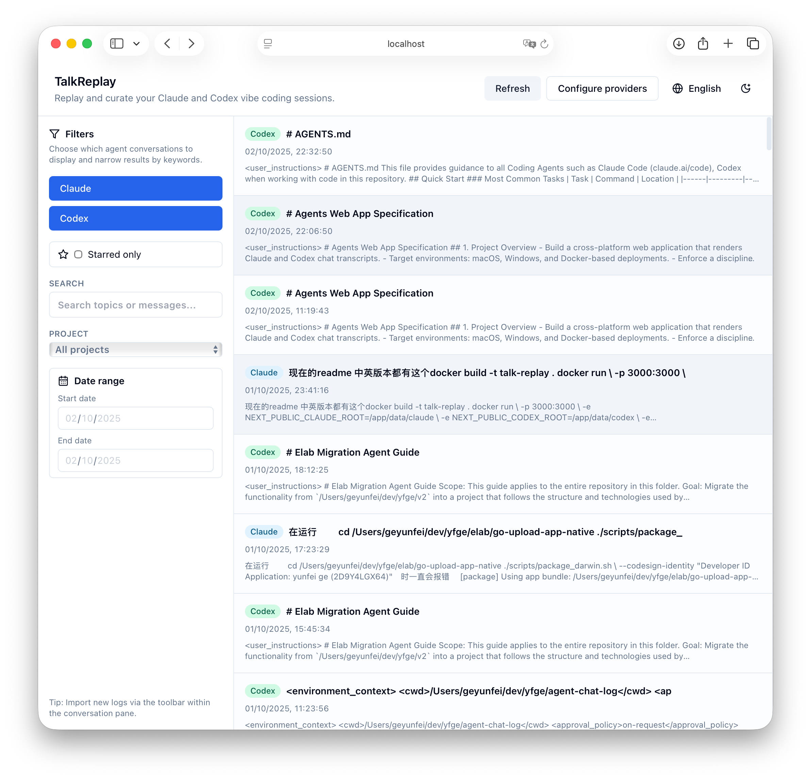
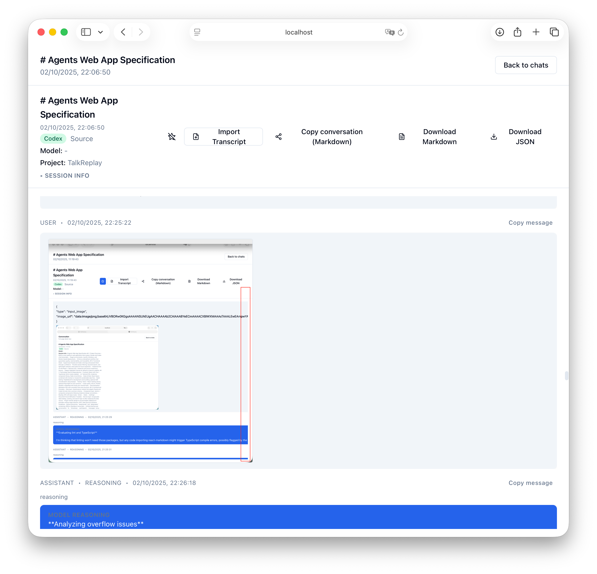
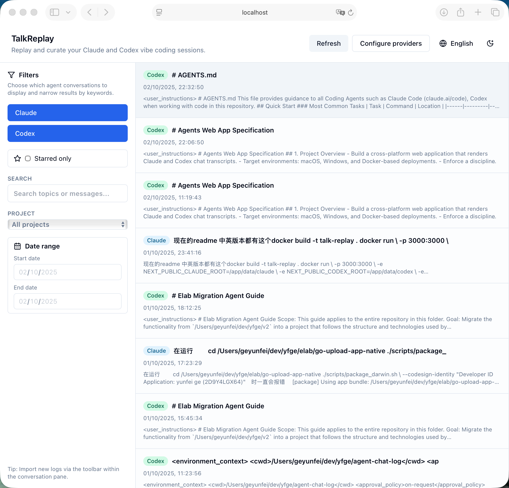
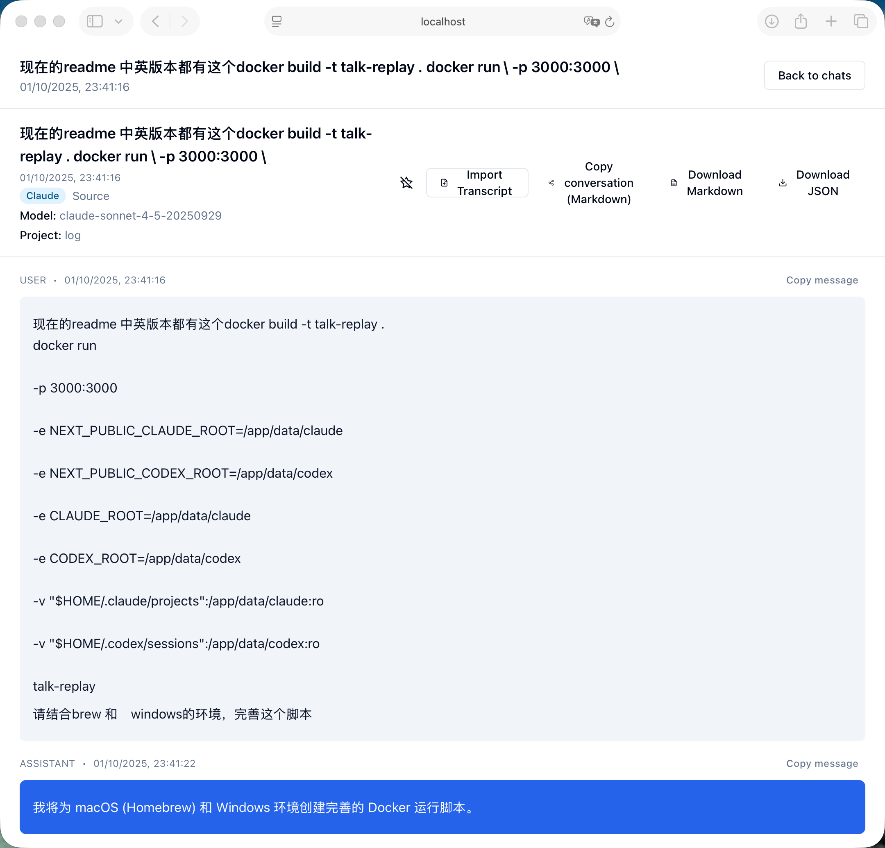

# TalkReplay

TalkReplay is a vibe coding companion that turns your Claude and Codex transcripts into an interactive replay. It helps you revisit pairing sessions, capture insights, and share polished summaries with teammates.

- **Languages:** [English](README.md) · [中文说明](README.zh.md)
- **Tech stack:** Next.js 14 (App Router) · React · TypeScript · Tailwind CSS · shadcn/ui · Zustand · React Query
- **Providers:** Claude (`~/.claude/projects`), Codex (`~/.codex/sessions`) with Gemini planned
- **Deployment targets:** macOS, Windows, Docker, optional browser-only imports
- **Workflow:** Opinionated vibe-coding blueprint featuring timestamped `agents_chat/` logs, `tasks.md` milestones, and Husky-enforced quality gates

## Why TalkReplay?

Vibe coding thrives on fast feedback loops. TalkReplay preserves that energy by:

- Ingesting local Claude/Codex sessions via pluggable adapters and a lightweight Node API
- Normalising timestamps/messages with provider metadata for consistent search and filters
- Providing a dual-pane explorer: session list on the left, detailed conversation on the right
- Tracking starred sessions, keyword filters, date ranges, and incremental refresh signatures
- Recording every collaboration round in `agents_chat/` and enforcing hooks for reproducibility
- Demonstrating a vibe coding workflow end-to-end so you can mirror the structure in other projects

## Vibe Coding Workflow

TalkReplay doubles as a living reference implementation for vibe coding teams:

- `agents_chat/` captures each AI pairing session using timestamped Markdown that logs prompts, decisions, code excerpts, and self-tests.
- Husky `pre-commit` hook blocks commits unless a new log is staged and `pnpm lint` / `pnpm test` pass, preserving replayable histories.
- `tasks.md` tracks milestone checklists so incremental commits stay aligned with the agreed plan.
- Shared specs (`agents.md`, `docs/`) keep collaboration guardrails co-located with the codebase.

## Interface Preview






### More Screens






## Getting Started (Local Dev)

```bash
pnpm install
pnpm dev -- --port 3002
```

Key scripts:

- `pnpm lint` – ESLint with Tailwind ordering
- `pnpm test` – Vitest + React Testing Library
- `pnpm build` – Next.js production build
- `pnpm format:fix` – Prettier write mode

The first run launches a provider setup dialog. Point Claude/Codex to your transcript roots or rely on environment defaults (see below). Configuration persists via a safe localStorage wrapper that falls back to an in-memory store when quotas are exceeded.

## Provider Roots & Configuration

Environment variables drive autodiscovery:

```bash
NEXT_PUBLIC_CLAUDE_ROOT=/Users/you/.claude/projects
NEXT_PUBLIC_CODEX_ROOT=/Users/you/.codex/sessions
NEXT_PUBLIC_GEMINI_ROOT=/path/to/gemini/logs # optional
```

Server-side fallbacks honour `CLAUDE_ROOT`, `CODEX_ROOT`, and `GEMINI_ROOT`. See `src/config/providerPaths.ts` for normalisation logic.

### Transcript Pipeline

- Provider ingestion lives under `src/lib/providers/`; adapters share a unified message schema in `src/types/chat.ts`.
- Incremental import signatures prevent reprocessing unchanged files while surfacing parser errors in the UI.
- Sample data in `fixtures/` mirrors real directory layouts for Claude and Codex, enabling offline demos.

## Docker Workflow

Build and run the production bundle inside Docker:

```bash
docker build -t talk-replay .
docker run \
  -p 3000:3000 \
  -e NEXT_PUBLIC_CLAUDE_ROOT=/app/data/claude \
  -e NEXT_PUBLIC_CODEX_ROOT=/app/data/codex \
  -e CLAUDE_ROOT=/app/data/claude \
  -e CODEX_ROOT=/app/data/codex \
  -v "$HOME/.claude/projects":/app/data/claude:ro \
  -v "$HOME/.codex/sessions":/app/data/codex:ro \
  talk-replay
```

Or use docker-compose:

```bash
CLAUDE_LOGS_PATH="$HOME/.claude/projects" \
CODEX_LOGS_PATH="$HOME/.codex/sessions" \
APP_PORT=3000 \
docker compose up --build
```

To demo bundled fixtures instead, set `CLAUDE_LOGS_PATH=./fixtures/claude` and `CODEX_LOGS_PATH=./fixtures/codex` before running compose. The container sets both runtime and `NEXT_PUBLIC_*` env variables so the UI skips manual setup.

## Testing & Quality Gates

- Husky pre-commit hook runs `pnpm lint`, `pnpm test`, and verifies `agents_chat` compliance
- Vitest integration covers `/api/sessions` and `/api/sessions/detail`
- Storybook is planned for core UI components; Playwright smoke tests are optional but recommended

## Documentation & Roadmap

- `tasks.md` – milestone tracking (Milestone 1 focuses on local replay, Milestone 2 on shared backend)
- `docs/browser-file-access.md` – browser capabilities for local imports
- `agents.md` – collaboration rules for vibe coding workflows
- `README.zh.md` – Chinese overview for bilingual teams

Future enhancements: Gemini support, virtualised lists, keyboard shortcuts, collaborative backend, and export tooling.

## License

[MIT](LICENSE)
